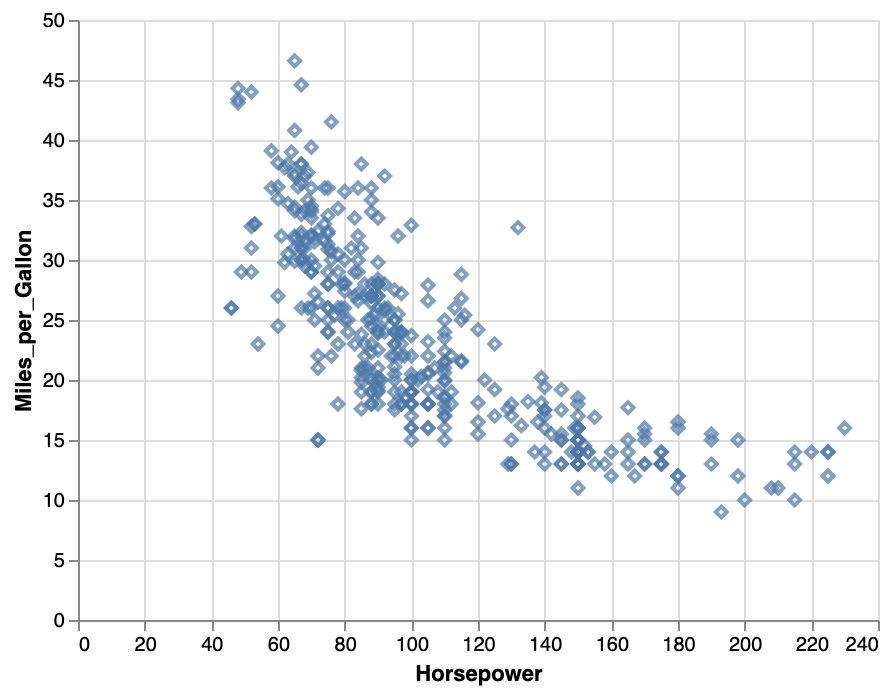

```{r setup, include=FALSE}
knitr::opts_chunk$set(echo = TRUE)
```

CS 625, Fall 2020

## Git, GitHub

1. *What is your GitHub username?*
Ans: rayansami

2. *What is the URL of your remote GitHub repo (created through Mr. Kennedy's exercises)?*
Ans: https://github.com/rayansami/cs625-data-visualization

## R

The command below will load the tidyverse package.  If you have installed R, RStudio, and the tidyverse package, it should display a list of loaded packages and their versions.
```{r}
library(tidyverse)
```

## R Markdown 

1. *Create an ordered bulleted list with at least 3 items*

    1. Apple
    2. Orange
    3. ODU
2. *Write a paragraph that demonstrates the use of italics, bold, bold italics, and code.*

This is how to _write_ **_print statement_** in **Python**:
`print('hello world')`

3. *Create an example of a fenced code block.*
```
    <html>
      <head>
        <title> Short Website </title>
      </head>
      <body>
        <p> Hello Pandemic World</p>
      </body>
    </html>
```
4. *Create a level 4 heading*

#### Level 4 heading

## R 

#### Data Visualization Exercises

1. *Run ggplot(data = mpg). What do you see?*
Ans: Running `ggplot(data = mpg)` shows nothing. But running
    ggplot(data = mpg) + 
      geom_point(mapping = aes(x = displ, y = hwy))
shows plot with _displ_ on x axis and _hway_ on y-axis

2. *How many rows are in mpg? How many columns?*
Ans: 224 rows and 10 columns

3. *What does the drv variable describe? Read the help for ?mpg to find out.*
Ans: the type of drive train, where f = front-wheel drive, r = rear wheel drive, 4 = 4wd

4. *Make a scatterplot of hwy vs cyl.*
Ans: 
```{r}
    x <- mpg$cyl
    y <- mpg$hwy
    plot(x,y, main ="hwy vs cyl",xlab="cyl",ylab="hwy")
```
5. *What happens if you make a scatterplot of class vs drv? Why is the plot not useful?*
Ans: class and drv both are _chr_ types. Scatterplot is generally used for plotting numerical value against another.

#### Workflow: basics Exercises

1. *Why does this code not work?*

```r
my_variable <- 10
my_varıable
```
my_varıable has not been assigned with anything.

2. *Tweak each of the following R commands so that they run correctly:*

```{r}
library(tidyverse)

ggplot(data = mpg) + 
  geom_point(mapping = aes(x = displ, y = hwy))

filter(mpg, cyl == 8)
filter(diamonds, carat > 3)
```

3. *Press Alt + Shift + K. What happens? How can you get to the same place using the menus?*
Ans: Shows keyboard shortcuts; In menu: Tools -> Keyboard Shortcuts Help

## Tableau

*Insert your the image of your final bar chart here*


1. *What conclusions can you draw from the chart?*

Ans: In the southern region, office supplies are profitable in cumulative considerations. 
There are large profits in Technology in recent years, which was absent in the past, especially in Southeastern Asia. Although the struggle in the profit of _Machines_ is noticeable throughout the years.

Specifically, in South America, _Furnitures_ is always profitable. But this category did very poorly in profit in 2014. Basically, 2014 was a bad year for the overall business, where 2013 was far better.

It appears the demand for _Accessories_ is getting higher by the time. However, _Machines_ are not at all profitable in this region. Perhaps, it(Machines) needs special attention.

The market for the _Phones_ is also good. Although the profit fell down in 2015.
The profit for _Supplies_ is very good in 2015, where it struggled in the past. Looks like the measures taken are started working.

## Observable and Vega-Lite

### A Taste of Observable

1. *In the "New York City weather forecast" section, try replacing `Forecast: detailedForecast` with `Forecast: shortForecast`. Then press the blue play button  or use Shift-Return to run your change. What happens?*

Ans: _detailedForecast_ is the combination of short-forecast and the information of wind, high/low temp details, and an estimation of precipitation. Where _shortForecast_ only gives the top view of the day's forecast and only says if the days are sunny, cloudy or if there is a chance for raining.

1. *Under the scatterplot of temperature vs. name, try replacing `markCircle()` with `markSquare()`. Then press the blue play button  or use Shift-Return to run your change. What happens? How about `markPoint()`?*

Ans: The points are some circles in `markCircle()` and `markSquare()` makes the squarish.`markPoint()` makes the edges of the points circular.

1. *Under "Pick a location, see the weather forecast", pick a location on the map.  Where was the point you picked near?*

Ans: I picked a point near Gloucester Courthouse, VA.

1. *The last visualization on this page is a "fancy" weather chart embedded from another notebook.  Click on the 3 dots next to that chart and choose 'Download PNG'.  Insert the PNG into your report.*


### Charting with Vega-Lite

1. *Pass an option of { size: 200 } to markCircle().*


The size of the circles is increased to 200x units. It looks denser and points have been disappeared in many regions of the plot.

1. *Try markSquare instead of markCircle.*

Ans: The points become squarish from being circular when using _markSquare_ instead of _markCircle_ 

1. *Try markPoint({ shape: 'diamond' }).*

Points get diamond shape. As _markPoint_ is being used, the edges are taking the shape and the background color takes over the insider area of the point.

1. *Change Horsepower to Acceleration*

Ans: The more horsepower the car has, the less fuel-efficient that car is.

But it harder to come into some consensus for the _Acceleration_. Some vehicles show lower mileage while some show higher mileage on the same acceleration. Also, some vehicles show high acceleration with very high mileage and vice versa.

1. *Swap what fields are displayed on the x- and y-axis* 

Looks like most of the cars have the acceleration of 10-20 while their miles per gallon is 10-40. And there are some outliers too.

1. *Change Name to Origin.*
Ans: Tooltips showed the car name for using _Name_. But _Origin_ shows the place the cars were built.

1. *Remove the vl.y().fieldN("Origin") line.*
Ans: No tooltips.

1. *Replace count() with average("Miles_per_Gallon").*
Ans: Japanese cars have the most miles per gallon on average while Europe follows Japan and the USA comes to the least.

## References

*Insert the list of sites you used as references as an unordered list with named links here.  This is required.*

* For Git Reference: https://rogerdudler.github.io/git-guide/
* R for Data Science Book: https://r4ds.had.co.nz/index.html
* R markdown: https://www.markdownguide.org/basic-syntax
* For shell: https://seankross.com/the-unix-workbench/command-line-basics.html
* Tableau Geeting Started video: https://www.tableau.com/learn/tutorials/on-demand/getting-started
* Tableau tutorial: https://help.tableau.com/current/guides/get-started-tutorial/en-us/get-started-tutorial-home.htm
* Observable | Data Apis: https://observablehq.com/@observablehq/introduction-to-data
* Taste of Observable: https://observablehq.com/@observablehq/a-taste-of-observable
