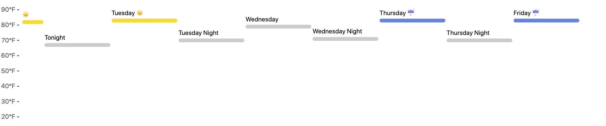

CS 625, Fall 2020

Git, GitHub
-----------

1.  *What is your GitHub username?* Ans: rayansami

2.  *What is the URL of your remote GitHub repo (created through
    Mr. Kennedy’s exercises)?* Ans:
    <a href="https://github.com/rayansami/cs625-data-visualization" class="uri">https://github.com/rayansami/cs625-data-visualization</a>

R
-

The command below will load the tidyverse package. If you have installed
R, RStudio, and the tidyverse package, it should display a list of
loaded packages and their versions.

    library(tidyverse)

    ## ── Attaching packages ───────────────────────────────────────────────────────────────────────────────────────────── tidyverse 1.3.0 ──

    ## ✓ ggplot2 3.3.2     ✓ purrr   0.3.4
    ## ✓ tibble  3.0.3     ✓ dplyr   1.0.2
    ## ✓ tidyr   1.1.2     ✓ stringr 1.4.0
    ## ✓ readr   1.3.1     ✓ forcats 0.5.0

    ## ── Conflicts ──────────────────────────────────────────────────────────────────────────────────────────────── tidyverse_conflicts() ──
    ## x dplyr::filter() masks stats::filter()
    ## x dplyr::lag()    masks stats::lag()

R Markdown
----------

1.  *Create an ordered bulleted list with at least 3 items*

    1.  Apple
    2.  Orange
    3.  ODU

2.  *Write a paragraph that demonstrates the use of italics, bold, bold
    italics, and code.*

This is how to *write* ***print statement*** in **Python**:
`print('hello world')`

1.  *Create an example of a fenced code block.*

<!-- -->

        <html>
          <head>
            <title> Short Website </title>
          </head>
          <body>
            
 Hello Pandemic World

          </body>
        </html>

1.  *Create a level 4 heading*

#### Level 4 heading

R
-

#### Data Visualization Exercises

1.  *Run ggplot(data = mpg). What do you see?* Ans: Running
    `ggplot(data = mpg)` shows nothing. But running ggplot(data = mpg) +
    geom\_point(mapping = aes(x = displ, y = hwy)) shows plot with
    *displ* on x axis and *hway* on y-axis

2.  *How many rows are in mpg? How many columns?* Ans: 224 rows and 10
    columns

3.  *What does the drv variable describe? Read the help for ?mpg to find
    out.* Ans: the type of drive train, where f = front-wheel drive, r =
    rear wheel drive, 4 = 4wd

4.  *Make a scatterplot of hwy vs cyl.* Ans:

<!-- -->

        x <- mpg$cyl
        y <- mpg$hwy
        plot(x,y, main ="hwy vs cyl",xlab="cyl",ylab="hwy")

 5. *What
happens if you make a scatterplot of class vs drv? Why is the plot not
useful?* Ans: class and drv both are *chr* types. Scatterplot is
generally used for plotting numerical value against another.

#### Workflow: basics Exercises

1.  *Why does this code not work?*

<!-- -->

    my_variable <- 10
    my_varıable

my\_varıable has not been assigned with anything.

1.  *Tweak each of the following R commands so that they run correctly:*

<!-- -->

    library(tidyverse)

    ggplot(data = mpg) + 
      geom_point(mapping = aes(x = displ, y = hwy))

    filter(mpg, cyl == 8)

    ## # A tibble: 70 x 11
    ##    manufacturer model     displ  year   cyl trans  drv     cty   hwy fl    class
    ##    <chr>        <chr>     <dbl> <int> <int> <chr>  <chr> <int> <int> <chr> <chr>
    ##  1 audi         a6 quatt…   4.2  2008     8 auto(… 4        16    23 p     mids…
    ##  2 chevrolet    c1500 su…   5.3  2008     8 auto(… r        14    20 r     suv  
    ##  3 chevrolet    c1500 su…   5.3  2008     8 auto(… r        11    15 e     suv  
    ##  4 chevrolet    c1500 su…   5.3  2008     8 auto(… r        14    20 r     suv  
    ##  5 chevrolet    c1500 su…   5.7  1999     8 auto(… r        13    17 r     suv  
    ##  6 chevrolet    c1500 su…   6    2008     8 auto(… r        12    17 r     suv  
    ##  7 chevrolet    corvette    5.7  1999     8 manua… r        16    26 p     2sea…
    ##  8 chevrolet    corvette    5.7  1999     8 auto(… r        15    23 p     2sea…
    ##  9 chevrolet    corvette    6.2  2008     8 manua… r        16    26 p     2sea…
    ## 10 chevrolet    corvette    6.2  2008     8 auto(… r        15    25 p     2sea…
    ## # … with 60 more rows

    filter(diamonds, carat > 3)

    ## # A tibble: 32 x 10
    ##    carat cut     color clarity depth table price     x     y     z
    ##    <dbl> <ord>   <ord> <ord>   <dbl> <dbl> <int> <dbl> <dbl> <dbl>
    ##  1  3.01 Premium I     I1       62.7    58  8040  9.1   8.97  5.67
    ##  2  3.11 Fair    J     I1       65.9    57  9823  9.15  9.02  5.98
    ##  3  3.01 Premium F     I1       62.2    56  9925  9.24  9.13  5.73
    ##  4  3.05 Premium E     I1       60.9    58 10453  9.26  9.25  5.66
    ##  5  3.02 Fair    I     I1       65.2    56 10577  9.11  9.02  5.91
    ##  6  3.01 Fair    H     I1       56.1    62 10761  9.54  9.38  5.31
    ##  7  3.65 Fair    H     I1       67.1    53 11668  9.53  9.48  6.38
    ##  8  3.24 Premium H     I1       62.1    58 12300  9.44  9.4   5.85
    ##  9  3.22 Ideal   I     I1       62.6    55 12545  9.49  9.42  5.92
    ## 10  3.5  Ideal   H     I1       62.8    57 12587  9.65  9.59  6.03
    ## # … with 22 more rows

1.  *Press Alt + Shift + K. What happens? How can you get to the same
    place using the menus?* Ans: Shows keyboard shortcuts; In menu:
    Tools -&gt; Keyboard Shortcuts Help

Tableau
-------

*Insert your the image of your final bar chart here*   1. *What conclusions can you
draw from the chart?*

Ans: In the southern region, office supplies are profitable in
cumulative considerations. There are large profits in Technology in
recent years, which was absent in the past, especially in Southeastern
Asia. Although the struggle in the profit of *Machines* is noticeable
throughout the years.

Specifically, in South America, *Furnitures* is always profitable. But
this category did very poorly in profit in 2014. Basically, 2014 was a
bad year for the overall business, where 2013 was far better.

It appears the demand for *Accessories* is getting higher by the time.
However, *Machines* are not at all profitable in this region. Perhaps,
it(Machines) needs special attention.

The market for the *Phones* is also good. Although the profit fell down
in 2015. The profit for *Supplies* is very good in 2015, where it
struggled in the past. Looks like the measures taken are started
working.

Observable and Vega-Lite
------------------------

### A Taste of Observable

1.  *In the “New York City weather forecast” section, try replacing
    `Forecast: detailedForecast` with `Forecast: shortForecast`. Then
    press the blue play button or use Shift-Return to run your change.
    What happens?*

Ans: *detailedForecast* is the combination of short-forecast and the
information of wind, high/low temp details, and an estimation of
precipitation. Where *shortForecast* only gives the top view of the
day’s forecast and only says if the days are sunny, cloudy or if there
is a chance for raining.

1.  *Under the scatterplot of temperature vs. name, try replacing
    `markCircle()` with `markSquare()`. Then press the blue play button
    or use Shift-Return to run your change. What happens? How about
    `markPoint()`?*

Ans: The points are some circles in `markCircle()` and `markSquare()`
makes the squarish.`markPoint()` makes the edges of the points circular.

1.  *Under “Pick a location, see the weather forecast”, pick a location
    on the map. Where was the point you picked near?*

Ans: I picked a point near Gloucester Courthouse, VA.

1.  *The last visualization on this page is a “fancy” weather chart
    embedded from another notebook. Click on the 3 dots next to that
    chart and choose ‘Download PNG’. Insert the PNG into your report.*
    

### Charting with Vega-Lite

1.  *Pass an option of { size: 200 } to markCircle().*

The size of the circles is increased to 200x units. It looks denser and
points have been disappeared in many regions of the plot.

1.  *Try markSquare instead of markCircle.*

Ans: The points become squarish from being circular when using
*markSquare* instead of *markCircle*

1.  *Try markPoint({ shape: ‘diamond’ }).*  Points get diamond shape. As
    *markPoint* is being used, the edges are taking the shape and the
    background color takes over the insider area of the point.

2.  *Change Horsepower to Acceleration*

Ans: The more horsepower the car has, the less fuel-efficient that car
is.

But it harder to come into some consensus for the *Acceleration*. Some
vehicles show lower mileage while some show higher mileage on the same
acceleration. Also, some vehicles show high acceleration with very high
mileage and vice versa.

1.  *Swap what fields are displayed on the x- and y-axis*  Looks like most
    of the cars have the acceleration of 10-20 while their miles per
    gallon is 10-40. And there are some outliers too.

2.  *Change Name to Origin.* Ans: Tooltips showed the car name for using
    *Name*. But *Origin* shows the place the cars were built.

3.  *Remove the vl.y().fieldN(“Origin”) line.* Ans: No tooltips.

4.  *Replace count() with average(“Miles\_per\_Gallon”).* Ans: Japanese
    cars have the most miles per gallon on average while Europe follows
    Japan and the USA comes to the least.

References
----------

*Insert the list of sites you used as references as an unordered list
with named links here. This is required.*

-   For Git Reference:
    <a href="https://rogerdudler.github.io/git-guide/" class="uri">https://rogerdudler.github.io/git-guide/</a>
-   R for Data Science Book:
    <a href="https://r4ds.had.co.nz/index.html" class="uri">https://r4ds.had.co.nz/index.html</a>
-   R markdown:
    <a href="https://www.markdownguide.org/basic-syntax" class="uri">https://www.markdownguide.org/basic-syntax</a>
-   For shell:
    <a href="https://seankross.com/the-unix-workbench/command-line-basics.html" class="uri">https://seankross.com/the-unix-workbench/command-line-basics.html</a>
-   Tableau Geeting Started video:
    <a href="https://www.tableau.com/learn/tutorials/on-demand/getting-started" class="uri">https://www.tableau.com/learn/tutorials/on-demand/getting-started</a>
-   Tableau tutorial:
    <a href="https://help.tableau.com/current/guides/get-started-tutorial/en-us/get-started-tutorial-home.htm" class="uri">https://help.tableau.com/current/guides/get-started-tutorial/en-us/get-started-tutorial-home.htm</a>
-   Observable | Data Apis:
    <a href="https://observablehq.com/@observablehq/introduction-to-data" class="uri">https://observablehq.com/@observablehq/introduction-to-data</a>
-   Taste of Observable:
    <a href="https://observablehq.com/@observablehq/a-taste-of-observable" class="uri">https://observablehq.com/@observablehq/a-taste-of-observable</a>
