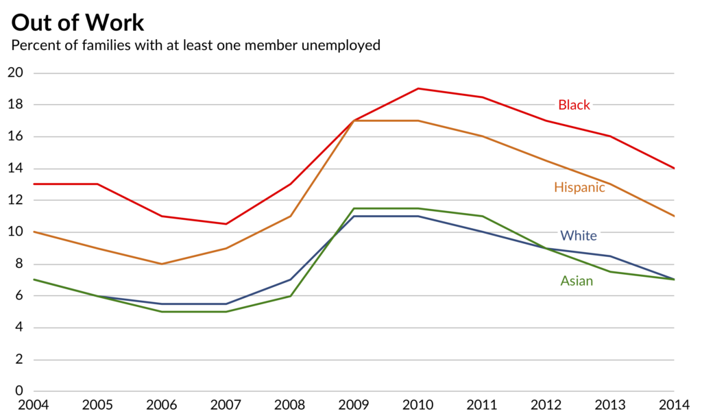

    MD Sami Uddin
    CS625-HW4

# Part 1

*Observable Link* : https://observablehq.com/@rayansami/hw4-recreate

## Article 1 : Remake: Paired Column Chart from WSJ

Multiple lines were used to draw this chart on observable. The actual chart was given like this: 

I shall recreate this one using a vega-lite API.

#### Editing Dataset
Removed photo and link. Added header name *Year*.

Reshaped the dataset and made a new column named *Race* which contains value either *Asian*,*Black*,*Hispanic*, or *White*. Furthermore, added another column named *Percentage* and put the values corresponding to race and years.

#### Chart Creation Steps

*Year* goes to the x-axis and *Percentage* goes to the y-axis. Set color based on *Race* and used color picker website to get the line colors and set them to scale after color. Note: colors are set in alphabetic order as legend shows.

#### Assessment for mimicking chart

I could not set the labels on the position as the image shows. Also, the chart background does not match.

#### Assessment of tool flexibility

Although the possibility is huge, I still find it difficult to use vega-lite API. So this tool still far less flexible to me compared to Tableau.

# Part 2

*Tableau Link* : https://prod-useast-a.online.tableau.com/#/site/oducs625/views/Book-Hw4-Sami/Part-2?:iid=1

## Article 2: Remaking an OECD Stacked Bar Chart (and some more general comments)

Here's the target chart-

#### Editing Dataset

Added header for countries. Remove everything other than the table with data only.

#### Chart Creation Steps

Added *Country* to Rows and *Low skilled*, *Medium skilled*, *High skilled* and *Total* to Columns. Sorted the chart based on *Total* and edited each axis from 0 to 80.60(which is highest total value) to scale each bar chart to one standard.

Removed the tick marks following this procedure-

    Right-click on the ticks; 
    
    Edit Axis-> GOTO Tick Marks -> Select None on both

Also removed titles and captions.

Selected *Hide Field Label for rows* after right-clicking on the top of country names.

**Color**: Added *Measure Names* to color and matched each chart with the image. For *High Skilled* I had to choose from *Blue-Teal*. And for *Low Skilled*, I had to choose it from *Color-Blind*. The rest of the column colors could be chosen from *Blue*.

#### Assessment for mimicking chart

Here's the chart I could create-

Could not fully mimic the chart. The background lines are still there. Although I have removed titles and captions, It appears when I export the chart as an image, they still exist.

#### Assessment of tool flexibility

Though I could not achieve the target fully, I would say Tableau is very flexible. It's easy to create a chart in no time if you have clean data. Also manipulating the view is easy.

### Disclaimer

I thought we need to implement all three articles and I implemented the first two datasets from Part-1 using Tableau. But later I chose to go with observable for implementing Part 1. However, I'm keeping my implementations on Tableau! 

# Reference

- Tableau 
    - Measure Values and Measure Names: https://help.tableau.com/current/pro/desktop/en-us/datafields_understanddatawindow_meavalues.htm
    - Make a dual-axis slope chart: https://evolytics.com/blog/tableau-201-how-to-make-dual-axis-slope-graphs/

    - Line Chart with open circles: https://www.dataplusscience.com/TadpoleChart.html

    - Match labels with mark color: http://drawingwithnumbers.artisart.org/feature-geek-coloring-labels-with-mark-colors-in-tableau-9-2/

    - Move the labels: https://www.tableau.com/about/blog/2016/1/tableau-confessions-you-can-move-labels-wow-49277

    - Edit Axis: https://help.tableau.com/current/pro/desktop/en-us/formatting_editaxes.htm

- Vega-Lite
    - Vega-Lite Docs: https://vega.github.io/vega-lite/docs/axis
    - Vegalite API: https://vega.github.io/vega-lite-api/api/
    - Facet Repeat Layer: https://observablehq.com/d/a4d527cf6b567011
    - Observable for Vega-Lite | Charting Layers: https://observablehq.com/@observablehq/layers-facets-concat
    - Visualization curriculum: https://observablehq.com/@uwdata/data-visualization-curriculum?collection=@uwdata/visualization-curriculum
    - Useful for Article 2 on Part 2
        - Horizontal concat *hconcat* : https://vega.github.io/vega-lite-api/api/hconcat

- Color picker from the image: https://imagecolorpicker.com/en/